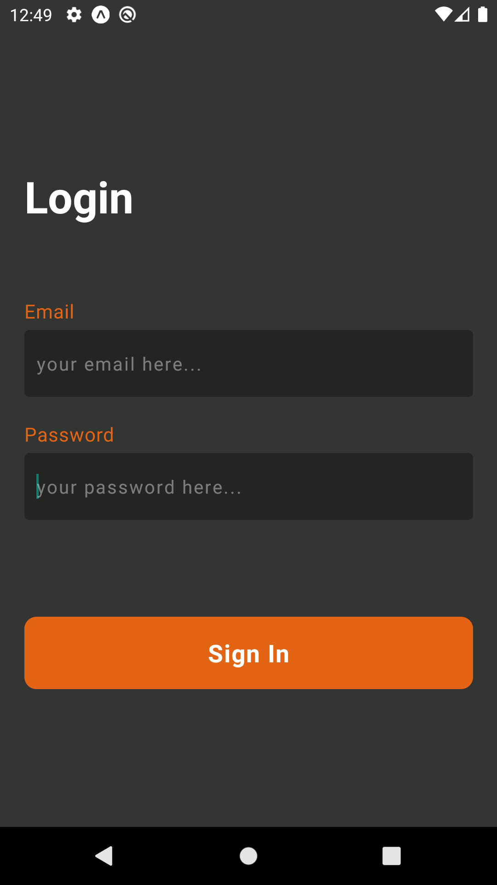
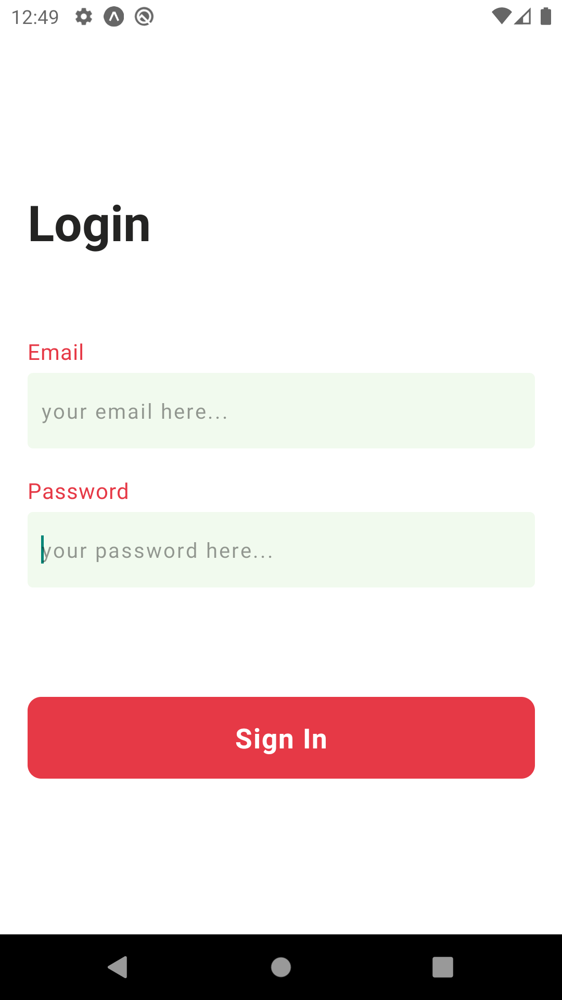
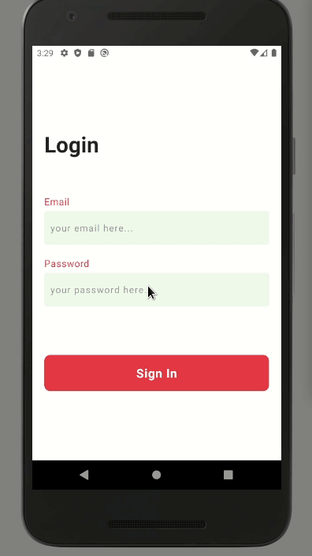

<h1 align="center">
  
</h1>

<h3 align="center">
  Expo Dark Mode
</h3>

  An simple app using dark mode

## 👨🏼‍💻 Development Contact

David Nascimento

- [Github](https://github.com/david32145)
- [nascimento32145@gmail.com](https://gmail.com)

## 🚀 Technologies

In the app was used `react-native` and `expo`.

### 📳 Mobile

- expo
- react-native;
- typescript;
- react-navigation;
- react-native-appearance;
- styled-components.

## 🎌 What I've learned

- Expo flow;
- Native dark mode;
- Theme with styled-component;

## 🏘️ Examples

<h1 align="left">
  
</h1>
<h1 align="left">
  
</h1>

## 🎥 How Usage

Example how usage app.

<h1 align="left">
  
</h1>

## ✋🏻 Prerequisites

- [Node.js](https://nodejs.org/en/)
- [Yarn](https://yarnpkg.com/pt-BR/docs/install)
- [Expo](https://docs.expo.io/)
- [Android Environment](https://developer.android.com/studio)

## 🔥 Install and Running

1. Config you environment;
2. Create an new virtual device and run;
3. Git clone `git clone https://github.com/david32145/expo-dark-mode.git`;
4. Enter in api folder;
5. Run `yarn android` or `npm run android`
6. Up your migrations with `yarn migration:up` or `npm run migration:up`;
7. Install expo app in emulator;
8. Open expo app and past the development url.
